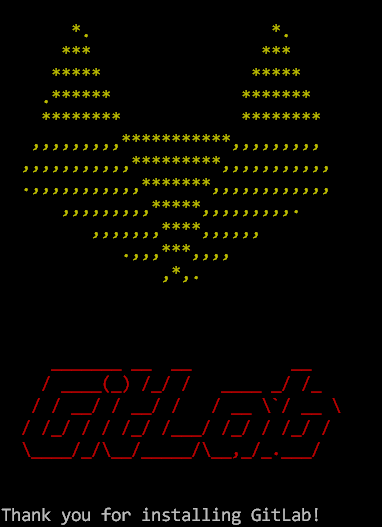
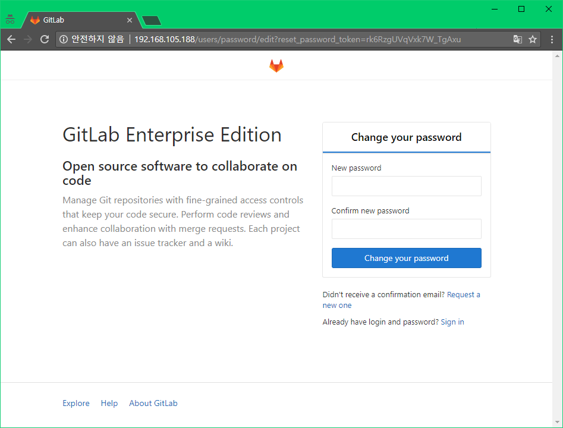

Ubuntu에 GitLab 설치 - 설치 가이드
==================================

### GitLab

GitLab은 git을 이용하여 repository부터 배포를 위한 pipeline까지 다양한 기능을 WebUI로 제공하는 서비스이다. UI는 GitHub와 유사한 UI를 필자는 14.04.5 LTS에 옴니버스 패키지 인스톨로 구성했다.**['GitLab 홈페이지'](https://about.gitlab.com/installation/#ubuntu)** 에서 패키지 설치 및 설정 방법을 가이드 하고 있다

### 1. Dependency 구성 및 설치

홈페이지에서는 16.04를 권장하고 있지만 상관없다.(필자는 14.04) 기본적으로 시스템 방화벽에서 HTTP, SSH를 오픈해줘야한다.

```sh
$ sudo apt-get update
$ sudo apt-get install -y curl openssh-server ca-certificates
```

다음 메일알림을 위해 postfix를 설치한다. 다른 솔루션을 사용해서 메일을 보내려면 이 단계를 건너뛰고 GitLab설치 후 외부 SMTP서버를 구성한다.

```sh
$ sudo apt-get install -y postfix
```

실행하면 분홍색 화면이 나온다. "2. internet site"를 선택하고 다음 단계에서 메일이름을 입력한다 추가화면이 나오면 기본값을 넣고 그냥 엔터!!

나중에 postfix설정사항을 변경하고 싶을땐  
/etc/postfix/main.cf 파일을 수정하면된다. ()필요하면 다른파일) 이후 postfix를 reload한다.

```sh
$ /etc/init.d/postfix reload
```

### 2. GitLab package repository 추가 및 package설치

GitLab package repository를 추가한다.

```sh
$ curl https://packages.gitlab.com/install/repositories/gitlab/gitlab-ee/script.deb.sh | sudo bash
```

그다음 GitLab 패키지를 설치한다. EXTERNAL_URL을 입력해서 접근하고자 하는 URL을 입력하여 install 한다.

```sh
$ sudo EXTERNAL_URL = "http://192.168.105.188" apt-get install gitlab-ee
```

이렇게 실행하면 아래와 같이 귀엽게 로고가 나오면서 설치가 완료되었다고 나온다.</img>

EXTERNAL_URL을 입력하지 않고 install할 경우에는 설치는 되지만

```sh
GitLab was unable to detect a valid hostname for your instance.
```

라는 문구가 나온다. /etc/gitlab/gitlab.rb 의 `external_url`부분에 접근 URL을 작성하고 설정을 반영한다.

```sh
$ sudo gitlab-ctl reconfigure
```

설치가 완료되었으면, 브라우져로 GitLab을 사용할 수 있다. 정상적으로 서비스가 구동중인지 확인하려면 gitlab-ctl status 로 확인가능하다

```sh
$ sudo gitlab-ctl status
run: gitaly: (pid 878) 5229s; run: log: (pid 873) 5229s
run: gitlab-monitor: (pid 898) 5229s; run: log: (pid 887) 5229s
run: gitlab-workhorse: (pid 875) 5229s; run: log: (pid 869) 5229s
run: logrotate: (pid 23132) 1649s; run: log: (pid 883) 5229s
run: nginx: (pid 876) 5229s; run: log: (pid 870) 5229s
run: node-exporter: (pid 877) 5229s; run: log: (pid 871) 5229s
run: postgres-exporter: (pid 881) 5229s; run: log: (pid 872) 5229s
run: postgresql: (pid 893) 5229s; run: log: (pid 882) 5229s
run: prometheus: (pid 25332) 243s; run: log: (pid 880) 5229s
run: redis: (pid 892) 5229s; run: log: (pid 891) 5229s
run: redis-exporter: (pid 890) 5229s; run: log: (pid 884) 5229s
run: sidekiq: (pid 25319) 243s; run: log: (pid 874) 5229s
run: unicorn: (pid 25461) 208s; run: log: (pid 879) 5229s
```

아까 패키지 설치시에 지정했던 EXTERNAL_URL 주소를 입력하면! 짜짠! 처음 접속했을때 패스워드 리셋화면이 보인다. 관리자 계정 비번을 설정하고 로그인을 시도할때 root로 신규 비번을 넣으면 된다.</img>

---

#####gitLab 설치

-	[Ubuntu에 GitLab 설치 - 설치 가이드](../gitlab/README.md)

#####jeinkins 설치

-	[Ubuntu에 Jenkins 설치 - 설치 가이드](../jenkins/README.md)

#####테스트 서버 설치

-	[Micro Service Architecture 서버 구축(1/4) - java8설치](../web_server/README.md)
-	[Micro Service Architecture 서버 구축(2/4) - tomcat8설치](../web_server/tomcat.md)
-	[Micro Service Architecture 서버 구축(3/4) - redis설치 ](../web_server/redis.md)
-	[Micro Service Architecture 서버 구축(4/4) - nginx설치 ](../web_server/nginx.md)

#####MariaDB 설치

-	[Ubuntu에 MariaDB 설치 - 설치 가이드](../mariadb/README.md)
