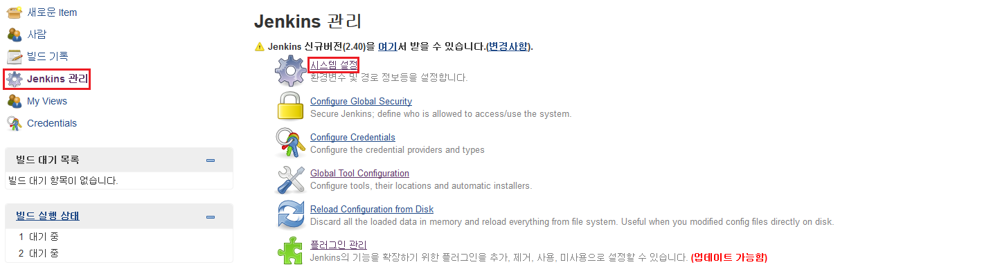
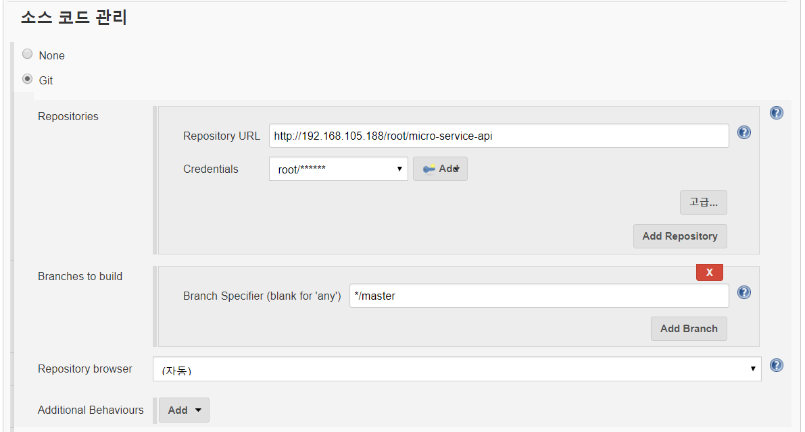

Ubuntu에 Jenkins 설치 - 설치 가이드
===================================

### Jenkins

빠른 배포와 프로젝트 수행시 인력의 변동에도 동일한 배포를 할 수 있도록 CI툴을 갖추는것이 중요하다.

Jenkins는 hudson때 보다도 더 많은 Plugin들로 편의성이 많이 향상 되었다.

GitLab에서 source를 가져와 build를 한 후 테스트 서버에 배포하는 과정으로 다음 jenkins를 설치해 보겠다.

### 1. 설치 및 설정

```sh
$ wget -q -O - https://pkg.jenkins.io/debian/jenkins-ci.org.key | sudo apt-key add -
$ sudo sh -c 'echo deb http://pkg.jenkins.io/debian-stable binary/ > /etc/apt/sources.list.d/jenkins.list'
$ sudo apt-get update
$ sudo apt-get install jenkins
```

####java8설치

java설치는 서버 환경구성 편에서 ubuntu 14.04에 java8 설치하는 방법을 참고한다.

[Micro Service Architecture 서버 구축(1/4) - java8설치](../web_server/README.md)

####jenkins 시작 설치가 모두 완료되었으면 해당 서버에 대해 설정정보를 수정후에 서버를 재기동한다.

```sh
$ vi /etc/default/jenkins
```

포트 정보 및 war경로등을 설정할 수 있다. 이제 재구동해본다.

```sh
$ sudo service jenkins restart
```

웹에 접속하여 최초 비밀번호를 넣어주고 기본 plugin을 설치해준다. 최초 비밀번호가 있는 경로는

```sh
$ /var/lib/jenkins/secret/initialAdminPassword
```

####Plugin 설치

Jenkins관리 > 플러그인 관리 메뉴로 이동


-	Gradle Plugin : Gradle을 사용하여 dependency 라이브러리를 로딩하여 컴파일한다.
-	Delibery Pipeline : 프로젝트간 연관관계를 정의하여 데쉬보드로 제공한다.
-	Shared Workspace : 여러 프로젝트에서 작업공간을 공유해서 사용한다.
-	Deploy to container Plugin : tomcat manager를 통해 배포한다.


플러그인 설치/업그레이드 중 이라는 화면이 나온다. 화면아래의 '설치가 끝나고 실행중인 작업이 없으면 Jenkins 재시작'을 선택한다. 플러그인 설치가 완료되면 Jenkins 재시작 단계가 Running이된다. 화면을 새로고침(F5)한다

####Global Tool Configuration 설정 Jenkins관리 > Global Tool Configuration 메뉴 선택


Gradle관련 설정을 해준다. 설정후 저장!!! 

####Shared Workspace설정 Jenkins 관리 > 시스템 설정 메뉴 선택



Workspace Sharing 항목에 설정 추가


### 2. 배포 설정

##### 프로젝트 생성

화면 좌 상단의 새로운 Item을 클릭하여 새로운 프로젝트를 생성한다.


설정화면에서 다음과 같이 shared workspace를 생성한다.


소스코드 관리에서 git repository를 설정한다. Global Credentails를 추가하여 접속인증을 한다.



Build단계에서 Gradle을 설정하고 Task를 다음과 같이 설정한다.(Test는 skip한다.)


Build후 조치단계에서 다음 프로젝트를 지정하여 pipeline으로 배포까지 이어지도록 설정한다. 다음 프로젝트는 생성한상태가 아니므로 경고문구가 나오지만 이름을 그대로 복사해뒀다가 생성하면 문제가 없다.


Build후 조치에서 다음 프로젝트 명을 복사해 뒀다가 다음 프로젝트를 생성한다. 프로젝트 생성은 처음 프로젝트 생성시와 동일하게 freestyle프로젝트로 생성한다.

동일하게 Shared Workspace를 생성한다.


Build후 조치 항목에서 "Deploy war/ear to a containe를 선택하고 아래 그림과 같이 설정한다. Containers에서는 Tomcat8.x를 선택하여 Credentals와 Tomcat URL을 입력한다.


####view 설정

Jenkins 메인화면에서 상단에 '+' 버튼이 있다 이를 늘려가면서 카테고리를 이용하여 프로젝트를 단위별로 구분지을 수 있다 'ALL'은 모든 프로젝트를 볼 수 있다.

프로젝트를 생성한 후에 기 생성된 프로젝트를 view에 추가할 수 있다.

</img>


####pipeline설정 pipeline을 설정하여 연결된 프로젝트가 진행되는 모습을 가시적으로 볼수 있는 데시보드로 활용 할 수 있다.

탭을 클릭한다. 

Delivery Pipeline View를 선택한다. 

아래 Conponents항목에서 두 연결된 프로젝트를 처음 시작 프로젝트와 끝나는 프로젝트를 설정하여 저장한다. 프로젝트 연결이 몇단계이든 상관없다. 연결만 되어있다면 처음과 끝만 입력하면 데쉬보드에 보인다. 

</img>

#### 배포하기

프로젝트 두개가 연결되어있는 모양새 이므로 처음프로젝트만 트리거링 되면 뒤에 연결되어있는 프로젝트는 자동적으로 실행된다.

---

#####gitLab 설치

-	[Ubuntu에 GitLab 설치 - 설치 가이드](../gitlab/README.md)

#####jenkins 설치

-	[Ubuntu에 Jenkins 설치 - 설치 가이드](../jenkins/README.md)

#####테스트 서버 설치

-	[Micro Service Architecture 서버 구축(1/4) - java8설치](../web_server/README.md)
-	[Micro Service Architecture 서버 구축(2/4) - tomcat8설치](../web_server/tomcat.md)
-	[Micro Service Architecture 서버 구축(3/4) - redis설치 ](../web_server/redis.md)
-	[Micro Service Architecture 서버 구축(4/4) - nginx설치 ](../web_server/nginx.md)

#####MariaDB 설치

-	[Ubuntu에 MariaDB 설치 - 설치 가이드](../mariadb/README.md)
