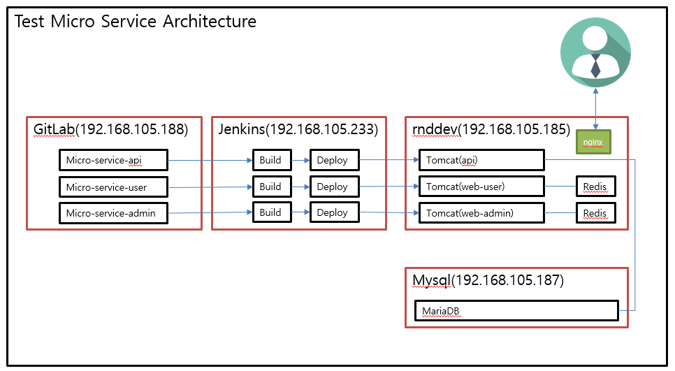
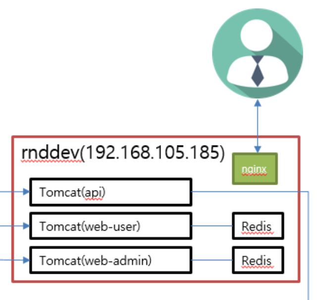
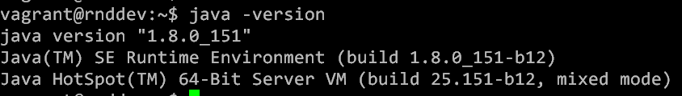

Micro Service Architecture 서버 구축(1/4) - java8 설치
======================================================

### Nginx + Tomcat8 + Redis + java8 서버 구축

Micro Service Architecture는 기능 별로 Application을 구현하고 각 Application은 RestAPI를 통해서 통신을 하는 구조를 갖는다. 각 Application은 작은 단위의 서비스별로 구현되어 각각의 독립성을 가지고 동작한다. 필자는 완벽한 Micro Service Architecture는 아니지만 웹서비스를 다음과 같이 3개의 Application으로 구현하려 한다. 1. User Web Application : 사용자 페이지 즉, 메인 웹페이지 2. Admin Web Application : 관리자 페이지 3. API Application : 사용자, 관리자 Application에서 Data 요청에대한 처리 등 DAO같은 역할

이렇게 3개의 Application은 각각의 주소를 갖고 있고 각각 필요에 의해 API와 통신하여 웹페이지에 정보를 구현하게 할 계획이다.

[PaaS](https://cloudfoundry.org)와 같은 플렛폼에서 Application을 올리게 되면 각각 독립적으로 구동되겠지만 IaaS나 Legacy환경에서는 각각의 서버에 올리거나 혹은 VM을 각각 생성시켜 구동 할 수도 있겠다.

하지만 테스트 환경으로 구축하는것이므로 웹서비스를 위한 리소스적 비용이 많이드니 **한개의 서버에서 port로 주소를 분리** 하겠다.(물론 한개의 서버에 여러 서비스가 동작하게되므로 서버가 죽었을때 Microservice의 이점이 사라지는건 사실이나 어디까지나 구현이 목적이므로... 이부분은 skip한다.)

또한 웹서비스를 **한개의 주소에서 볼 수** 있도록 NginX를 이용하겠다.

각각의 Application은 Session정보를 Redis를 이용하여 저장하도록 겠다. 아래와 같은 구조를 갖게 될 것이다.

</img>

### 1. Ubuntu 14.04 LTS에 JDK1.8설치

필자는 Vagrant Box를 Ubuntu 14.04 LTS로 올려 사용했다. 여기에 Tomcat8과 Java1.8을 사용하려했다. 그런데.. **그런데!!!!**

Ubuntu 14.04의 마지막 Update에서는 jdk1.7까지만 지원되고 그 다음버전은 별도의 작업을 해줘야 사용할 수 있다. (Ubuntu 16.04는 'apt-get install openjdk-8-jdk' 명령으로 바로 설치 가능하다.)

14.04에 jdk8이 있는 Repository를 추가해서 설치한다. repository를 추가하는 방법은 다음과 같다.

```sh
$ sudo add-apt-repository 레포지토리
```

14.04에는 기본적으로 add-apt-repository 명령이 없으므로 이명령을 쓸 수 있도록 다음과 같이 software-properties-common을 설치해준다.

```sh
$ sudo apt-get install software-properties-common
```

이제 레포지토리를 추가 후에 Jdk 1.8을 설치한다.

```sh
$ sudo add-apt-repository ppa:webupd8team/java -y
$ sudo apt-get update
$ sudo apt-get install oracle-java8-installer
```

설치 완료!!!



---

#####gitLab 설치

-	[Ubuntu에 GitLab 설치 - 설치 가이드](../gitlab/README.md)

#####jeinkins 설치

-	[Ubuntu에 Jenkins 설치 - 설치 가이드](../jenkins/README.md)

#####테스트 서버 설치

-	[Micro Service Architecture 서버 구축(1/4) - java8설치](../web_server/README.md)
-	[Micro Service Architecture 서버 구축(2/4) - tomcat8설치](../web_server/tomcat.md)
-	[Micro Service Architecture 서버 구축(3/4) - redis설치 ](../web_server/redis.md)
-	[Micro Service Architecture 서버 구축(4/4) - nginx설치 ](../web_server/nginx.md)

#####MariaDB 설치

-	[Ubuntu에 MariaDB 설치 - 설치 가이드](../mariadb/README.md)
